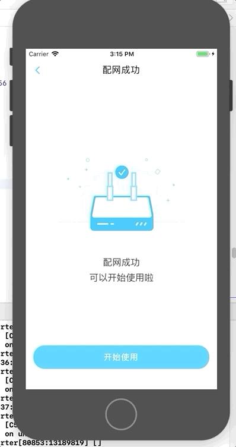
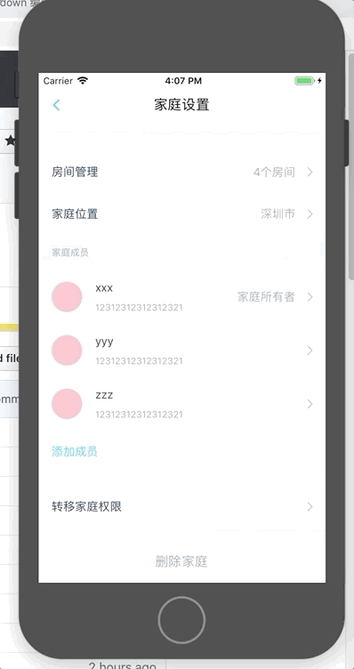
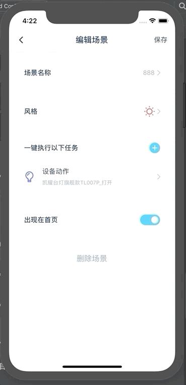
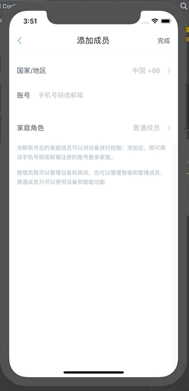
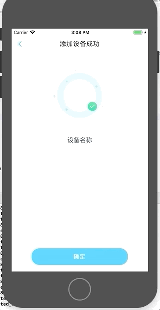
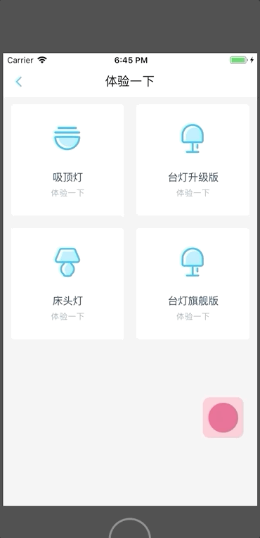

# *RN-components*
生产环境中实际使用可将组件复制到工程中安装相应依赖后直接import使用，方便后续开发，并且根据需要修改
## 1、SVG相关
React Native 工程中安卓环境不支持直接读取SVG文件，相关组件基于react-native-svg-uri和react-native-svg封装开发
### OnlineSvg
- 参数支持设置宽高颜色及其他样式
- iconURI直接填写对应的URI即可
- 增加本地缓存机制避免重复在线加载

``` javascript
<DeviceSVG
  width={50}
  height={50}
  color={"pink"}
  style={{ marginBottom: 24 }}
  iconURI={"https://panel.app.ha.mxchip.com/test/1394ac7a-1fb4-42b2-ba04-c995bf126a4b.svg"}
/>
```

### LocalSvg
- 需要命令行运行`node getSvg`脚本将本地svg图片生成svgIndex文件，需要根据实际文档结构修改脚本中的文件路径
- icon属性直接填写svgIndex中的key值即可


``` javascript
<LocalSVG
  icon={"icon_back"}
  height={14}
  width={14}
  color={"#FF4D4F"}
/>
```

## 2、Modal相关
项目中各种常见形式的带遮罩的二级弹窗

### input


``` javascript
import Modal, {ModalType} from ".components/Modal"
<Modal
  display={this.state.showInput}
  type={ModalType.input}
  option={{
    content: "请输入设备名称",
    defaultValue: this.state.nickName,
    confirm: {
      title: "确认",
      titleStyle: {
        color: "rgba(43, 140, 249, 1.00)",
      },
      onPress: this._editDeviceName,
    },
    cancel: {
      title: "跳过",
      onPress: this._skipTheStep
    },
  }}
/> 
```

### confirm


``` javascript
import Modal, {ModalType} from ".components/Modal"
<Modal
  type={ModalType.confirm}
  display={this.state.showConfirmModal}
  option={{
    title: this.modalConfig.title,
    content: this.modalConfig.content,
    confirm: {
      title: global.I18n.t("NetConnecting_ModalButton_Confirm"),
      titleStyle: {
        backgroundColor: global.config.theme.basic.mainColor,
        color: "#fff",
      },
      onPress: this.hideConfirmModal,
    },
    cancel: {
      title: global.I18n.t("NetConnecting_ModalButton_Cancel"),
      titleStyle: {
        backgroundColor: "#F5F5F5",
        color: "#183B56",
      },
      onPress: this.hideConfirmModal,
    },
  }}
/>
```

### loading


``` javascript
<Modal
  display={this.state.isShowLoading}
  type={ModalType.loading}
/>
```

## 3、Toast相关
项目中常用的选项弹窗

### BottomToastOption

- display一般由页面的state维护
- setIndex对应选择后的后调函数，会将用户选择的index自动传参
- optionList对应选项内容
- title和cancel可以根据需要自行添加
``` javascript
import BottomToastOption from "../../components/BottomToastOption"
<BottomToastOption
  display={this.state.showRoleToast}
  setIndex={this.setOptionIndex}
  optionList={[
    {
      text: "管理员",
      value: 7,
    },
    {
      text: "普通用户",
      value: 6666,
    },
  ]}
  title={"角色设定"}
  cancel={true}
/>
```

### TopOption

- 为方便使用封装在NavigationBar内部,直接通过DeviceEventEmitter触发
``` javascript
import {DeviceEventEmitter} from "react-native"
const toastConfig = {
  text: "弹出的文本内容",
}
DeviceEventEmitter.emit("showNavigationToast", toastConfig)
```

### Vbutton


### 柱状图


### 折线图

