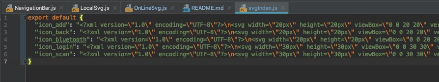

# *RN-components*
所有组件可直接复制到工程中安装相应依赖后直接import使用
## 1、SVG相关
React Native 工程中安卓环境不支持直接读取SVG文件，相关组件基于react-native-svg-uri和react-native-svg封装开发
### OnlineSvg
- 参数支持设置宽高颜色及其他样式
- iconURI直接填写对应的URI即可
- 增加本地缓存机制避免重复在线加载

``` javascript
<DeviceSVG
  width={50}
  height={50}
  color={"pink"}
  style={{ marginBottom: 24 }}
  iconURI={"https://panel.app.ha.mxchip.com/test/1394ac7a-1fb4-42b2-ba04-c995bf126a4b.svg"}
/>
```

### LocalSvg
- 需要命令行运行`node getSvg`脚本将本地svg图片生成svgIndex文件，需要根据实际文档结构修改脚本中的文件路径
- icon属性直接填写svgIndex中的key值即可



``` javascript
<LocalSVG
  icon={"icon_back"}
  height={14}
  width={14}
  color={"#FF4D4F"}
/>
```

## 2、Modal相关
项目中各种常见形式的带遮罩的二级弹窗

### input


``` javascript
import Modal, {ModalType} from ".components/Modal"
<Modal
  display={this.state.showInput}
  type={ModalType.input}
  option={{
    content: "请输入设备名称",
    defaultValue: this.state.nickName,
    confirm: {
      title: "确认",
      titleStyle: {
        color: "rgba(43, 140, 249, 1.00)",
      },
      onPress: this._editDeviceName,
    },
    cancel: {
      title: "跳过",
      onPress: this._skipTheStep
    },
  }}
/> 
```